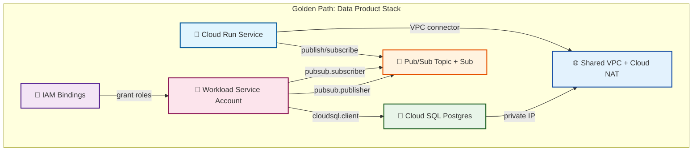

# GCP Terraform Platform Modules

A portfolio-grade, versioned Terraform module library for Google Cloud Platform
(GCP). This repository demonstrates how platform teams structure an **Internal
Developer Platform** or **Golden Path** module registry: small, reusable,
composable modules that application teams combine to deploy repeatable
infrastructure patterns.

> **Goal**: Give any engineer a clear, copy-paste-able path from "I need a data
> product stack" to "I have a VPC, database, Pub/Sub topic, Cloud Run service, and
> IAM bindings wired together correctly."

## Philosophy

- **Reusable modules, not monolithic stacks**: Each module under `modules/` does
  one thing well and exposes only the inputs and outputs needed to compose it.
- **Versioned via git refs**: Consumers pin to a specific tag or commit so that
  upstream changes never break a deployment unexpectedly.
- **Composition in `examples/`**: Root modules in `examples/` show how platform
  teams assemble the library into a deployable product pattern.
- **Safety by default**: `for_each` over `count`, validation blocks on enums,
  deletion protection on stateful resources, and additive IAM as the default.
- **No provider blocks in modules**: Modules declare required provider
  constraints, but the caller owns the provider configuration.

## Module Inventory

| Module | Purpose | Key Resources |
|--------|---------|---------------|
| [`modules/vpc-shared`](modules/vpc-shared) | Shared VPC with subnets, Cloud NAT, and firewall rules. | `google_compute_network`, `google_compute_subnetwork`, `google_compute_router_nat`, `google_compute_firewall` |
| [`modules/cloud-run-service`](modules/cloud-run-service) | Cloud Run (2nd gen) service with env vars, secrets, VPC connector, and IAM. | `google_cloud_run_v2_service`, `google_cloud_run_v2_service_iam_member` |
| [`modules/pubsub-topic-sub`](modules/pubsub-topic-sub) | Pub/Sub topic + subscriptions with ack deadlines, DLQ, retry policy. | `google_pubsub_topic`, `google_pubsub_subscription` |
| [`modules/iam-binding`](modules/iam-binding) | Reusable IAM role bindings for project or common resources, additive or authoritative. | `google_project_iam_member`/`binding`, `google_pubsub_topic_iam_member`/`binding`, etc. |
| [`modules/cloud-sql-postgres`](modules/cloud-sql-postgres) | Postgres instance with private IP, backups, maintenance, replicas. | `google_sql_database_instance`, `google_service_networking_connection` |
| [`modules/cloud-composer`](modules/cloud-composer) | Cloud Composer 2 environment with workload config and networking. | `google_composer_environment` |

## Example: Data Product Deploy

The [`examples/data-product-deploy`](examples/data-product-deploy) root module
shows how to compose the modules into one repeatable data-product instance:



## Consuming a module

Pin every module to a git tag (or commit SHA) so your deployments are
reproducible:

```hcl
module "vpc_shared" {
  source = "github.com/your-org/gcp-terraform-platform-modules//modules/vpc-shared?ref=v1.0.0"

  project_id   = var.gcp_project_id
  network_name = "prod-shared-vpc"

  subnets = [
    {
      name   = "app-subnet"
      region = "us-central1"
      cidr   = "10.0.0.0/24"
    }
  ]
}
```

For local development inside this repository, the examples use relative paths:

```hcl
module "vpc_shared" {
  source = "../../modules/vpc-shared"
  # ...
}
```

## Repository Layout

```text
.
├── modules/
│   ├── vpc-shared/
│   ├── cloud-run-service/
│   ├── pubsub-topic-sub/
│   ├── iam-binding/
│   ├── cloud-sql-postgres/
│   └── cloud-composer/
├── examples/
│   └── data-product-deploy/
├── .gitignore
├── LICENSE
└── README.md
```

Every module contains:

```text
modules/<name>/
├── main.tf
├── variables.tf
├── outputs.tf
├── versions.tf
└── README.md
```

## Validation

All modules and the example have been formatted and validated with Terraform.

```bash
# Format everything
terraform fmt -recursive

# Validate each module/example
for dir in modules/* examples/*; do
  terraform -chdir="$dir" init -backend=false
  terraform -chdir="$dir" validate
done
```

## Design Principles

1. **No `provider` blocks in modules** — callers configure providers.
2. **No `.tfvars` files in modules** — modules receive inputs from callers.
3. **`for_each` over `count`** — stable resource keys prevent accidental
   replacement when lists change.
4. **Validation blocks** — catch bad inputs early (enums, ranges, unique names).
5. **Meaningful outputs** — every important resource attribute is exposed.
6. **Documented trade-offs** — especially for IAM additive vs authoritative modes.

## Getting Started

1. Clone the repository.
2. Pick an example (start with `examples/data-product-deploy`).
3. Copy `terraform.tfvars.example` to `terraform.tfvars` and fill in your
   `project_id`.
4. Run `terraform init`, `terraform plan`, and `terraform apply`.

## License

This project is licensed under the MIT License — see [`LICENSE`](LICENSE).
