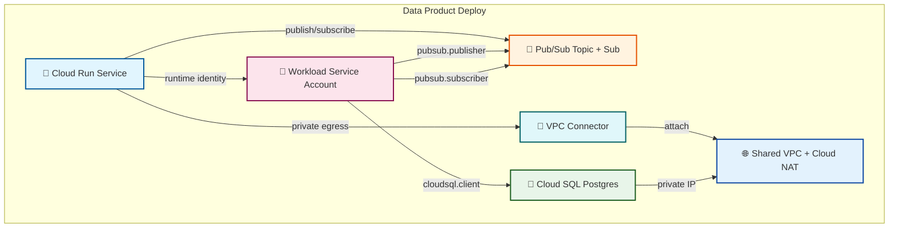

# data-product-deploy

A realistic root module example that composes the platform modules together to
deploy **one instance** of a repeatable "data product" pattern across a GCP project.

This is the kind of root module a platform team would publish in an Internal
Developer Platform catalog: a pre-wired stack that application teams can copy,
customize with a few variables, and deploy.

## What it deploys



## Usage

1. Copy `terraform.tfvars.example` to `terraform.tfvars` and fill in your values.
2. Initialize and apply:

```bash
cd examples/data-product-deploy
terraform init
terraform plan
terraform apply
```

## Inputs

| Name | Description | Type | Default | Required |
|------|-------------|------|---------|----------|
| `project_id` | GCP project ID. | `string` | n/a | yes |
| `region` | Primary GCP region. | `string` | `"us-central1"` | no |
| `environment` | Environment name. | `string` | `"dev"` | no |
| `name_prefix` | Prefix for naming resources. | `string` | `"data-product"` | no |
| `network_cidr` | CIDR block for the app subnet. | `string` | `"10.0.0.0/24"` | no |
| `database_tier` | Cloud SQL machine tier. | `string` | `"db-f1-micro"` | no |
| `cloud_run_image` | Container image for the Cloud Run service. | `string` | `"gcr.io/google-samples/hello-app:1.0"` | no |
| `cloud_run_invoker_members` | IAM members allowed to invoke the service. | `list(string)` | `[]` | no |

## Outputs

| Name | Description |
|------|-------------|
| `vpc_network_id` | The ID of the shared VPC network. |
| `cloud_run_service_url` | The URL of the deployed Cloud Run service. |
| `cloud_sql_connection_name` | The Cloud SQL connection name. |
| `cloud_sql_private_ip` | The private IP of the Cloud SQL instance. |
| `pubsub_topic_name` | The Pub/Sub topic name. |
| `pubsub_subscription_name` | The Pub/Sub subscription name. |
| `workload_service_account_email` | The workload service account email. |

## Consuming modules from GitHub

In a real platform registry, you would pin module sources to a git ref:

```hcl
module "vpc_shared" {
  source = "github.com/your-org/gcp-terraform-platform-modules//modules/vpc-shared?ref=v1.0.0"
  # ...
}
```

This example uses relative paths (`../../modules/...`) so it can be validated
locally inside this repository.
