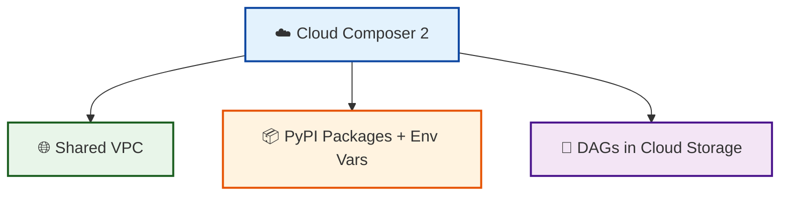

# cloud-composer

A reusable module that creates a **Cloud Composer 2** environment.



## What is this for?

```text
cloud-composer
    │
    ├──► Orchestrate data pipelines with managed Apache Airflow
    │
    ├──► Run pipelines in a private VPC alongside other workloads
    │
    ├──► Scale workers automatically based on DAG demand
    │
    ├──► Install custom Python packages and Airflow variables
    │
    └──► Schedule maintenance windows that fit your business hours
```

This module is designed to be composed with `vpc-shared` so that data pipelines
run in a private, shared VPC alongside Cloud Run services and Cloud SQL databases.

## What it does

- Creates a Cloud Composer 2 environment.
- Configures the environment size (`SMALL`, `MEDIUM`, `LARGE`).
- Configures workload shapes for scheduler, triggerer, web server, and worker.
- Supports custom PyPI packages and Airflow environment variables.
- Supports private IP and IP masquerade agent options.
- Configures a maintenance window.

## Usage

```hcl
module "composer" {
  source = "github.com/your-org/gcp-terraform-platform-modules//modules/cloud-composer?ref=v1.0.0"

  project_id = var.gcp_project_id
  name       = "data-product-pipelines"
  region     = "us-central1"

  environment_size = "ENVIRONMENT_SIZE_MEDIUM"
  node_count       = 3

  image_version   = "composer-2.9.3-airflow-2.7.3"
  airflow_version = "2.7.3"

  env_variables = {
    ENV              = "production"
    GCP_PROJECT_ID   = var.gcp_project_id
    GCS_BUCKET       = "gs://my-bucket"
  }

  pypi_packages = {
    "google-cloud-bigquery" = "==3.18.0"
    "pandas"                = "==2.1.4"
  }

  network    = module.vpc_shared.network_self_link
  subnetwork = module.vpc_shared.subnet_self_links["app-subnet"]

  service_account = module.composer_service_account.email

  ip_allocation_policy = {
    cluster_secondary_range_name  = "pods"
    services_secondary_range_name = "services"
  }

  worker = {
    cpu        = 4
    memory_gb  = 15
    storage_gb = 10
    min_count  = 2
    max_count  = 8
  }

  labels = {
    environment = "production"
    managed_by  = "terraform"
  }
}
```

## Inputs

| Name | Description | Type | Default | Required |
|------|-------------|------|---------|----------|
| `project_id` | GCP project ID where the Composer environment will be created. | `string` | n/a | yes |
| `name` | Name of the Cloud Composer 2 environment. | `string` | n/a | yes |
| `region` | GCP region for the environment. | `string` | `"us-central1"` | no |
| `environment_size` | Environment size. | `string` | `"ENVIRONMENT_SIZE_MEDIUM"` | no |
| `node_count` | Number of worker nodes in the GKE cluster. | `number` | `3` | no |
| `image_version` | Composer image version. | `string` | `"composer-2.9.3-airflow-2.7.3"` | no |
| `airflow_version` | Airflow version. | `string` | `"2.7.3"` | no |
| `env_variables` | Environment variables for Airflow. | `map(string)` | `{}` | no |
| `pypi_packages` | PyPI packages to install. | `map(string)` | `{}` | no |
| `scheduler` | Scheduler workload configuration. | `object({...})` | see `variables.tf` | no |
| `triggerer` | Triggerer workload configuration. | `object({...})` | see `variables.tf` | no |
| `web_server` | Web server workload configuration. | `object({...})` | see `variables.tf` | no |
| `worker` | Worker workload configuration. | `object({...})` | see `variables.tf` | no |
| `network` | VPC network self_link or name. | `string` | `null` | no |
| `subnetwork` | Subnetwork self_link or name. | `string` | `null` | no |
| `service_account` | Service account email for GKE nodes. | `string` | `null` | no |
| `ip_allocation_policy` | IP allocation policy for the GKE cluster. | `object({...})` | see `variables.tf` | no |
| `enable_private_environment` | Enable private IP for the environment. | `bool` | `false` | no |
| `enable_ip_masq_agent` | Enable IP masquerade agent. | `bool` | `true` | no |
| `maintenance_window` | Maintenance window configuration. | `object({...})` | see `variables.tf` | no |
| `labels` | Labels to apply to the environment. | `map(string)` | `{}` | no |

## Outputs

| Name | Description |
|------|-------------|
| `environment_id` | The ID of the Cloud Composer environment. |
| `environment_name` | The name of the environment. |
| `environment_region` | The region of the environment. |
| `airflow_uri` | The URI of the Airflow web server. |
| `dag_gcs_prefix` | The Cloud Storage prefix where DAGs are stored. |
| `gke_cluster` | The GKE cluster self_link backing the environment. |
| `composer_service_account` | The default service account used by Composer. |

## Design Notes

- **Shared VPC**: Pass the network and subnetwork from `vpc-shared` to keep
  Composer in the same network as your data-product workloads.
- **Service account**: Use a dedicated service account with least-privilege roles
  (`roles/composer.worker`, `roles/logging.logWriter`, etc.) rather than the
  default Compute Engine service account.
- **Airflow overrides**: The module sets `core-dags_are_paused_at_creation` to
  `True` by default. Add more overrides by extending `airflow_config_overrides`
  in `main.tf` or exposing it as a variable.
