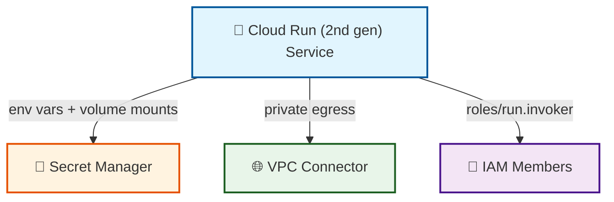

# cloud-run-service

A reusable module that deploys a **Cloud Run (2nd gen)** service on GCP.



## What is this for?

```text
cloud-run-service
        │
        ├──► Run containers on GCP without managing servers or Kubernetes clusters
        │
        ├──► Pass configuration like database hostnames and API keys via env vars
        │
        ├──► Keep secrets safe by pulling them from Secret Manager instead of hard-coding
        │
        ├──► Control who can access it — only specific users or other GCP services
        │
        ├──► Connect to private databases and resources inside your VPC
        │
        └──► Scale automatically from zero to thousands of requests
```

This module is designed to be composed with `vpc-shared`, `pubsub-topic-sub`, and
`cloud-sql-postgres` as part of a repeatable data-product stack.

## Quick Start

```hcl
module "api" {
  source = "github.com/your-org/gcp-terraform-platform-modules//modules/cloud-run-service?ref=v1.0.0"

  project_id   = "my-project-123"
  region       = "us-central1"
  service_name = "payment-api"
  image_uri    = "gcr.io/my-project-123/payment-api:v2.1.0"

  # Simple config values
  environment_variables = {
    LOG_LEVEL = "debug"
    DB_HOST   = "10.0.0.5"
  }

  # Sensitive values pulled from Secret Manager
  secret_environment_variables = [
    {
      name    = "DB_PASSWORD"
      secret  = "db-password"
      version = "latest"
    }
  ]

  # Only these users/services can call the API
  invoker_members = [
    "user:alice@example.com",
    "serviceAccount:batch-job@my-project-123.iam.gserviceaccount.com"
  ]

  # Always keep 1 instance warm, but never exceed 20
  min_instances = 1
  max_instances = 20
}
```

After running `terraform apply`, your service will be live at a URL like:

```text
https://payment-api-abc123-uc.a.run.app
```

## Usage

```hcl
module "cloud_run" {
  source = "github.com/your-org/gcp-terraform-platform-modules//modules/cloud-run-service?ref=v1.0.0"

  project_id   = var.gcp_project_id
  region       = "us-central1"
  service_name = "data-product-api"
  image_uri    = "gcr.io/my-project/data-product-api:v1.0.0"

  cpu    = "1"
  memory = "1Gi"

  min_instances = 1
  max_instances = 10

  environment_variables = {
    LOG_LEVEL = "info"
    ENV       = "production"
  }

  secret_environment_variables = [
    {
      name    = "DB_PASSWORD"
      secret  = "db-password"
      version = "latest"
    }
  ]

  secret_volumes = [
    {
      name       = "service-account-key"
      secret     = "service-account-key"
      path       = "key.json"
      mount_path = "/secrets"
      version    = "latest"
    }
  ]

  service_account = module.workload_service_account.email

  vpc_connector = google_vpc_access_connector.connector.id
  egress        = "PRIVATE_RANGES_ONLY"
  ingress       = "INGRESS_TRAFFIC_INTERNAL_ONLY"

  invoker_members = [
    "serviceAccount:scheduler@my-project.iam.gserviceaccount.com"
  ]

  labels = {
    environment = "production"
    managed_by  = "terraform"
  }
}
```

## Inputs

| Name | Description | Type | Default | Required |
|------|-------------|------|---------|----------|
| `project_id` | GCP project ID where the Cloud Run service will be deployed. | `string` | n/a | yes |
| `region` | GCP region for the Cloud Run service. | `string` | `"us-central1"` | no |
| `service_name` | Name of the Cloud Run service. Must be unique within the project and region. | `string` | n/a | yes |
| `image_uri` | Container image URI for the Cloud Run service. | `string` | n/a | yes |
| `cpu` | CPU limit for the container. | `string` | `"1"` | no |
| `memory` | Memory limit for the container. | `string` | `"512Mi"` | no |
| `min_instances` | Minimum number of instances. Use 0 to scale to zero. | `number` | `0` | no |
| `max_instances` | Maximum number of instances. | `number` | `100` | no |
| `allow_unauthenticated` | Allow unauthenticated invocations from the internet. | `bool` | `false` | no |
| `invoker_members` | Additional IAM members to grant `roles/run.invoker`. | `list(string)` | `[]` | no |
| `environment_variables` | Plain environment variables for the container. | `map(string)` | `{}` | no |
| `secret_environment_variables` | Secrets from Secret Manager injected as env vars. | `list(object({ name = string, secret = string, version = string }))` | `[]` | no |
| `secret_volumes` | Secret Manager secrets mounted as volumes. | `list(object({ name = string, secret = string, path = string, mount_path = string, version = string }))` | `[]` | no |
| `vpc_connector` | VPC connector ID or self_link for VPC access. | `string` | `null` | no |
| `egress` | Egress settings: `ALL_TRAFFIC` or `PRIVATE_RANGES_ONLY`. | `string` | `"PRIVATE_RANGES_ONLY"` | no |
| `service_account` | Service account email for the Cloud Run runtime. | `string` | `null` | no |
| `ingress` | Ingress policy. | `string` | `"INGRESS_TRAFFIC_ALL"` | no |
| `labels` | Labels to apply to the Cloud Run service. | `map(string)` | `{}` | no |

## Outputs

| Name | Description |
|------|-------------|
| `service_id` | The ID of the Cloud Run service. |
| `service_name` | The name of the Cloud Run service. |
| `service_url` | URL to access the Cloud Run service. |
| `service_location` | The region where the Cloud Run service is deployed. |
| `service_status` | The status conditions of the Cloud Run service. |
| `latest_revision_name` | Name of the latest created revision. |

## Design Notes

- **Cloud Run 2nd gen**: Uses `google_cloud_run_v2_service`, which provides better
  networking, scaling, and feature parity with Cloud Run jobs.
- **Image immutability in state**: The module ignores changes to the container image
  after initial deployment so that CI/CD pipelines can deploy new images without
  causing Terraform drift. If you want Terraform to manage image versions strictly,
  remove `template[0].containers[0].image` from the `lifecycle.ignore_changes` list.
- **No provider block**: The module does not declare a provider, so it can be reused
  across projects and regions.
