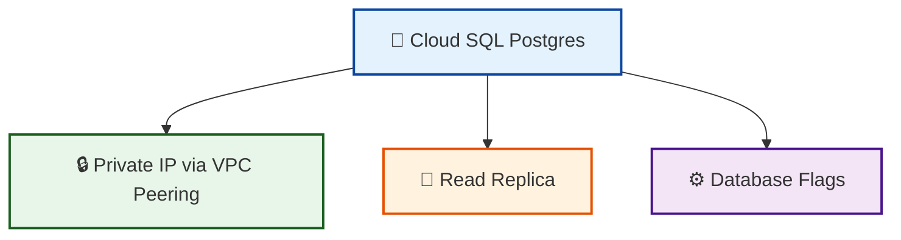

# cloud-sql-postgres

A reusable Cloud SQL Postgres module.



## What is this for?

```text
cloud-sql-postgres
    │
    ├──► Run a managed Postgres database without managing VMs
    │
    ├──► Keep database traffic private via VPC peering
    │
    ├──► Recover from mistakes with automated backups and PITR
    │
    ├──► Scale reads with cross-region read replicas
    │
    └──► Tune the database with custom flags
```

This module is designed to be composed with `vpc-shared` to provide a private,
managed Postgres backend for data-product workloads.

## What it does

- Creates a Cloud SQL Postgres primary instance.
- Optionally allocates a private IP range and creates a VPC peering connection
  for private IP access.
- Configures automated backups and point-in-time recovery.
- Configures a maintenance window.
- Enables Query Insights by default.
- Supports database flags and authorized networks.
- Optionally creates read replicas in other regions.

## Usage

```hcl
module "postgres" {
  source = "github.com/your-org/gcp-terraform-platform-modules//modules/cloud-sql-postgres?ref=v1.0.0"

  project_id = var.gcp_project_id
  name       = "data-product-db"
  region     = "us-central1"

  database_version = "POSTGRES_15"
  tier             = "db-custom-2-3840"
  availability_type = "REGIONAL"

  disk_size             = 100
  disk_autoresize       = true
  disk_autoresize_limit = 500

  backup_configuration = {
    enabled                        = true
    start_time                     = "03:00"
    point_in_time_recovery_enabled = true
    transaction_log_retention_days = 7
    retained_backups               = 30
    retention_unit                 = "COUNT"
  }

  maintenance_window = {
    day          = 7
    hour         = 3
    update_track = "stable"
  }

  ip_configuration = {
    ipv4_enabled        = false
    private_network     = module.vpc_shared.network_self_link
    allocate_private_ip = true
    authorized_networks = []
    ssl_mode            = "ENCRYPTED_ONLY"
  }

  database_flags = [
    {
      name  = "max_connections"
      value = "500"
    }
  ]

  replicas = [
    {
      name              = "data-product-db-replica"
      region            = "us-east1"
      availability_type = "ZONAL"
    }
  ]

  labels = {
    environment = "production"
    managed_by  = "terraform"
  }
}
```

## Inputs

| Name | Description | Type | Default | Required |
|------|-------------|------|---------|----------|
| `project_id` | GCP project ID where the Cloud SQL instance will be created. | `string` | n/a | yes |
| `name` | Name of the Cloud SQL Postgres instance. | `string` | n/a | yes |
| `region` | GCP region for the primary instance. | `string` | `"us-central1"` | no |
| `database_version` | Postgres database version. | `string` | `"POSTGRES_15"` | no |
| `tier` | Machine type tier. | `string` | `"db-f1-micro"` | no |
| `edition` | Cloud SQL edition. | `string` | `"ENTERPRISE"` | no |
| `availability_type` | `ZONAL` or `REGIONAL`. | `string` | `"ZONAL"` | no |
| `disk_size` | Initial disk size in GB. | `number` | `10` | no |
| `disk_autoresize` | Enable automatic disk resize. | `bool` | `true` | no |
| `disk_autoresize_limit` | Maximum disk size in GB. | `number` | `100` | no |
| `backup_configuration` | Automated backup settings. | `object({...})` | see `variables.tf` | no |
| `maintenance_window` | Maintenance window settings. | `object({...})` | see `variables.tf` | no |
| `ip_configuration` | IP configuration including private IP. | `object({...})` | see `variables.tf` | no |
| `database_flags` | List of database flags. | `list(object({ name = string, value = string }))` | `[]` | no |
| `insights_config` | Query Insights configuration. | `object({...})` | see `variables.tf` | no |
| `replicas` | List of read replica configurations. | `list(object({...}))` | `[]` | no |
| `deletion_protection` | Enable deletion protection on the primary instance. | `bool` | `true` | no |
| `labels` | Labels to apply to the instance. | `map(string)` | `{}` | no |

## Outputs

| Name | Description |
|------|-------------|
| `instance_name` | The name of the primary Cloud SQL instance. |
| `instance_connection_name` | The connection name of the primary instance. |
| `instance_self_link` | The self_link of the primary instance. |
| `private_ip_address` | The private IP address of the primary instance. |
| `public_ip_address` | The public IP address of the primary instance. |
| `replica_names` | Map of replica names to replica instance names. |
| `replica_connection_names` | Map of replica names to replica connection names. |

## Design Notes

- **Private IP**: The module optionally creates a `/16` private IP allocation and a
  VPC peering connection via Service Networking. Pass the VPC network self_link
  from `vpc-shared` to keep database traffic off the public internet.
- **Deletion protection**: Enabled by default on the primary instance to prevent
  accidental destruction. Disable only in ephemeral environments.
- **Read replicas**: Use `instance_type = "READ_REPLICA_INSTANCE"` and reference
  the primary instance name. Replicas inherit the database version from the primary.
