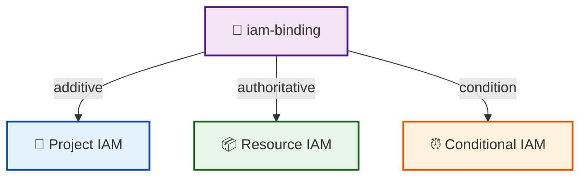

# iam-binding

A reusable IAM binding module for GCP.



## What is this for?

```text
iam-binding
    │
    ├──► Grant a role to one or more IAM principals
    │
    ├──► Add members safely without touching existing bindings (additive)
    │
    ├──► Enforce an exact member list for a role (authoritative)
    │
    ├──► Target project-level or resource-level policies
    │
    └──► Apply temporary or attribute-based access conditions
```

This module helps platform teams enforce consistent IAM assignments across
multiple data-product deployments.

## What it does

- Binds an IAM role to a list of members.
- Supports two binding modes:
  - **additive** (`google_*_iam_member`): adds each member without touching
    existing bindings for the same role.
  - **authoritative** (`google_*_iam_binding`): sets the exact list of members
    for the role, removing any members not in the list.
- Supports project-level and resource-level targets.
- Optional IAM condition expression for temporary or attribute-based access.

## Usage

### Additive project-level binding

```hcl
module "project_iam" {
  source = "github.com/your-org/gcp-terraform-platform-modules//modules/iam-binding?ref=v1.0.0"

  project_id = var.gcp_project_id
  mode       = "additive"
  role       = "roles/monitoring.metricWriter"
  members = [
    "serviceAccount:data-product-sa@my-project.iam.gserviceaccount.com"
  ]
}
```

### Authoritative binding on a Pub/Sub subscription

```hcl
module "subscription_iam" {
  source = "github.com/your-org/gcp-terraform-platform-modules//modules/iam-binding?ref=v1.0.0"

  project_id    = var.gcp_project_id
  mode          = "authoritative"
  resource_type = "pubsub_subscription"
  resource_id   = "data-product-events-worker"
  role          = "roles/pubsub.subscriber"
  members = [
    "serviceAccount:data-product-sa@my-project.iam.gserviceaccount.com"
  ]
}
```

### Conditional binding

```hcl
module "conditional_iam" {
  source = "github.com/your-org/gcp-terraform-platform-modules//modules/iam-binding?ref=v1.0.0"

  project_id = var.gcp_project_id
  mode       = "additive"
  role       = "roles/storage.objectViewer"
  members = [
    "group:data-team@example.com"
  ]

  condition = {
    title       = "business_hours_only"
    description = "Access only during business hours"
    expression  = "request.time.getHours("America/New_York") >= 9 && request.time.getHours("America/New_York") <= 17"
  }
}
```

## Inputs

| Name | Description | Type | Default | Required |
|------|-------------|------|---------|----------|
| `project_id` | GCP project ID where the IAM binding will be applied. | `string` | n/a | yes |
| `mode` | Binding mode: `additive` or `authoritative`. | `string` | `"additive"` | no |
| `resource_type` | Type of resource to bind the role to. | `string` | `"project"` | no |
| `resource_id` | Resource identifier (topic/subscription/service/bucket name). Not used for project. | `string` | `null` | no |
| `resource_location` | GCP region for the resource. Required when `resource_type` is `cloud_run_service`. | `string` | `null` | no |
| `role` | IAM role to bind (e.g., `roles/run.invoker`). | `string` | n/a | yes |
| `members` | List of IAM members to bind to the role. | `list(string)` | n/a | yes |
| `condition` | Optional IAM condition for the binding. | `object({ title = string, description = optional(string, ""), expression = string })` | `null` | no |

### Supported `resource_type` values

- `project`
- `pubsub_topic`
- `pubsub_subscription`
- `cloud_run_service` (requires `resource_location`)
- `storage_bucket`

## Outputs

| Name | Description |
|------|-------------|
| `mode` | The binding mode used. |
| `resource_type` | The resource type the role was bound to. |
| `resource_id` | The resource identifier the role was bound to. |
| `role` | The IAM role that was bound. |
| `members` | The IAM members that were bound. |

## Additive vs Authoritative: Trade-offs

| Pattern | Resource type | Behavior | Best for |
|---------|---------------|----------|----------|
| **Additive** | `google_*_iam_member` | Adds each member independently. Does not remove existing bindings. | Safe to use in composition: multiple modules or teams can grant the same role without fighting over state. |
| **Authoritative** | `google_*_iam_binding` | Sets the exact member list for the role. Removes members not in the list. | When you want Terraform to be the single source of truth for all members of a role on a resource. |

### Important caveats

- **Additive mode** is the safest default for reusable modules and platform
  libraries because it avoids accidentally revoking access granted by other
  Terraform states, manual console changes, or organization policies.
- **Authoritative mode** is powerful but dangerous: if two Terraform states both
  manage authoritative bindings for the same role on the same resource, they will
  overwrite each other on every apply. Use it only when one state owns the entire
  binding list.
- Authoritative mode at the **project** level can be especially risky because it
  affects all project-level members for the given role.

## Design Notes

- Each resource type has two conditional resources (one for additive, one for
  authoritative). Only the resources matching the chosen `mode` and
  `resource_type` are created.
- `for_each` is used in additive mode so that adding or removing a member does
  not force replacement of unrelated members.
