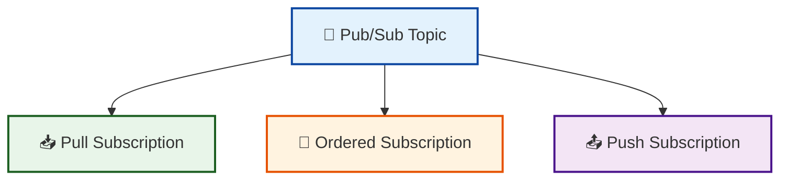

# pubsub-topic-sub

A reusable Pub/Sub module that creates a topic plus one or more subscriptions.



## What is this for?

```text
pubsub-topic-sub
    │
    ├──► Decouple producers from consumers with an async message bus
    │
    ├──► Retry failed deliveries with exponential backoff
    │
    ├──► Route poison messages to a dead-letter topic
    │
    ├──► Preserve message order for related events
    │
    └──► Push events to HTTPS endpoints or let workers pull them
```

This module is designed to be composed with `cloud-run-service` and
`cloud-sql-postgres` as part of an event-driven data-product stack.

## What it does

- Creates a single Pub/Sub topic.
- Creates any number of subscriptions attached to that topic.
- Supports pull subscriptions with retry and dead-letter policies.
- Supports push subscriptions with OIDC token authentication.
- Uses `for_each` keyed by subscription name for stable state management.

## Usage

```hcl
module "pubsub" {
  source = "github.com/your-org/gcp-terraform-platform-modules//modules/pubsub-topic-sub?ref=v1.0.0"

  project_id = var.gcp_project_id
  topic_name = "data-product-events"

  topic_labels = {
    environment = "production"
    managed_by  = "terraform"
  }

  subscriptions = [
    {
      name                 = "data-product-events-worker"
      ack_deadline_seconds = 60
      retry_policy = {
        minimum_backoff = "10s"
        maximum_backoff = "600s"
      }
      dead_letter_policy = {
        dead_letter_topic     = "projects/my-project/topics/data-product-events-dlq"
        max_delivery_attempts = 5
      }
    },
    {
      name                         = "data-product-events-ordered"
      ack_deadline_seconds         = 20
      enable_message_ordering      = true
      enable_exactly_once_delivery = true
    },
    {
      name          = "data-product-events-webhook"
      push_config = {
        push_endpoint = "https://api.example.com/events"
        oidc_token = {
          service_account_email = "push-invoker@my-project.iam.gserviceaccount.com"
        }
      }
    }
  ]
}
```

## Inputs

| Name | Description | Type | Default | Required |
|------|-------------|------|---------|----------|
| `project_id` | GCP project ID where the Pub/Sub resources will be created. | `string` | n/a | yes |
| `topic_name` | Name of the Pub/Sub topic. Must be unique within the project. | `string` | n/a | yes |
| `topic_labels` | Labels to apply to the Pub/Sub topic. | `map(string)` | `{}` | no |
| `message_retention_duration` | Minimum duration to retain a message in the topic. | `string` | `null` | no |
| `kms_key_name` | Optional Cloud KMS key name for topic message encryption (CMEK). | `string` | `null` | no |
| `allowed_persistence_regions` | List of GCP regions where messages may be persisted. | `list(string)` | `[]` | no |
| `subscriptions` | List of subscriptions to attach to the topic. | `list(object({...}))` | `[]` | no |
| `subscription_labels` | Labels to apply to all subscriptions. | `map(string)` | `{}` | no |

### `subscriptions` object schema

| Field | Description | Type | Default |
|-------|-------------|------|---------|
| `name` | Subscription name. | `string` | required |
| `ack_deadline_seconds` | Acknowledgement deadline in seconds (10-600). | `number` | `10` |
| `message_retention_duration` | How long to retain unacknowledged messages. | `string` | `"86600s"` |
| `retain_acked_messages` | Retain acknowledged messages. | `bool` | `false` |
| `expiration_policy_ttl` | TTL after which the subscription expires. Empty string disables expiration. | `string` | `""` |
| `filter` | Pub/Sub filter expression. | `string` | `""` |
| `enable_message_ordering` | Enable message ordering. | `bool` | `false` |
| `enable_exactly_once_delivery` | Enable exactly-once delivery. | `bool` | `false` |
| `retry_policy` | Retry policy with `minimum_backoff` and `maximum_backoff`. | `object` | `null` |
| `dead_letter_policy` | Dead-letter policy with `dead_letter_topic` and `max_delivery_attempts`. | `object` | `null` |
| `push_config` | Push delivery config with `push_endpoint`, `attributes`, and optional `oidc_token`. | `object` | `null` |

## Outputs

| Name | Description |
|------|-------------|
| `topic_id` | The ID of the Pub/Sub topic. |
| `topic_name` | The name of the Pub/Sub topic. |
| `subscription_ids` | Map of subscription names to subscription IDs. |
| `subscription_names` | Map of subscription names to their resource names. |
| `subscription_paths` | Map of subscription names to their fully-qualified paths. |

## Design Notes

- **Stable state**: Subscriptions are created with `for_each` keyed by name, so
  adding or removing a subscription does not affect others.
- **Dead-letter topics**: The module expects the dead-letter topic to already
  exist or to be created separately. Pass its fully-qualified topic name
  (e.g., `projects/my-project/topics/my-dlq`).
- **Push subscriptions**: Use `push_config` only when you need Pub/Sub to push
  messages to an HTTPS endpoint. Pull subscriptions are the default when
  `push_config` is omitted.
